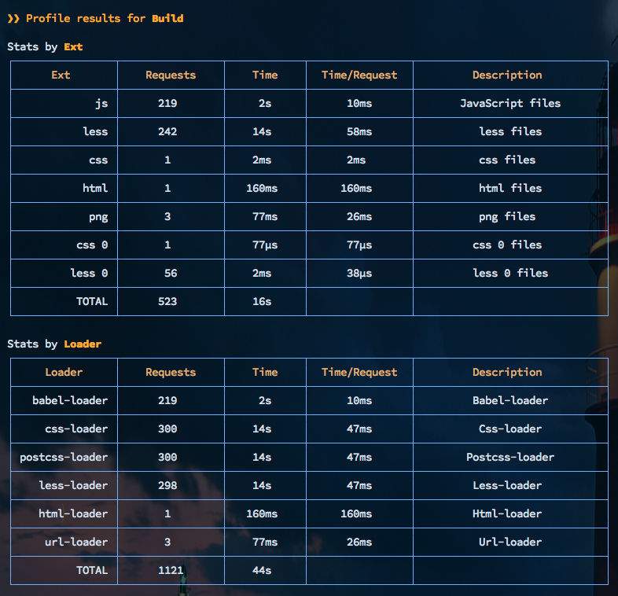

# Bundle 分析

很多团队在使用 Webpack 的时候，不会关注打包后的性能问题，使用[webpack-bundle-analyzer](https://github.com/webpack-contrib/webpack-bundle-analyzer/)可以帮忙排查打包不合理的情况，一般会遇见下面的问题：

1. 打入不必要的包，引入过多的内容，比如`lodash`，需要使用`lodash`babel 插件来解决；
2. 打包优先级错误，导致本来不需提前引入的包，可以使用动态加载的方式来引入；
3. 多页面情况下没有拆包，每个页面一个包，这种情况可以使用`spiltChunks`来进行拆包，将公共内容拆成一个包。

San CLI 内置了[webpack-bundle-analyzer](https://github.com/webpack-contrib/webpack-bundle-analyzer/)，方便使用，只需要在`san build --analyze`

## 分析结果

除了直接使用 webpack-bundle-analyzer 查看结果，还可以将 Bundle 结果保存下来，用于分析和比较两次打包的结果，查找是否打包合理，San CLI 的 build 使用下面的两个方式来将分析结果进行保存：

-   `--report-json，--reportJson`：是否输将包分析报表生成为 report.json，值为 true 或 false，默认是 false
-   `--report`：是否输将包分析报表生成为单个 HTML 文件，值为 true 或 false，默认 false，仅生成 Webpack Stats JSON 文件

关于 Bundle 结果的分析可以查看[这篇文章](https://survivejs.com/webpack/optimizing/build-analysis/)介绍了很多 Bundle 分析工具。这些工具的使用方法都是将生成的报告 JSON 地址上传上去，然后分析，这里就不再赘余了。

## 打包性能分析

如果需要排查 loader 或者 plugin 的性能问题，可以使用 `san build --profile`，打包后会出现对应的性能表格。

